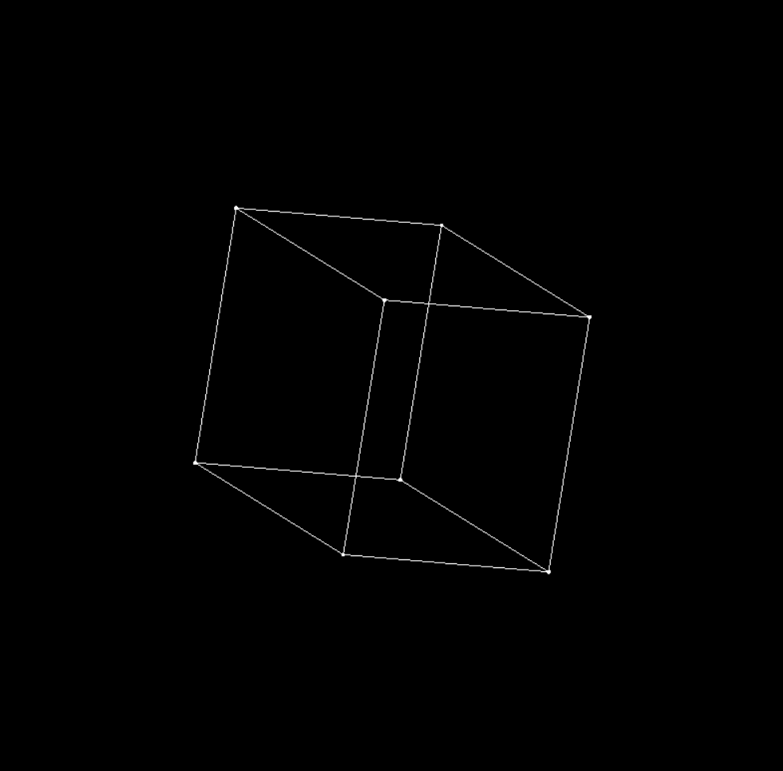
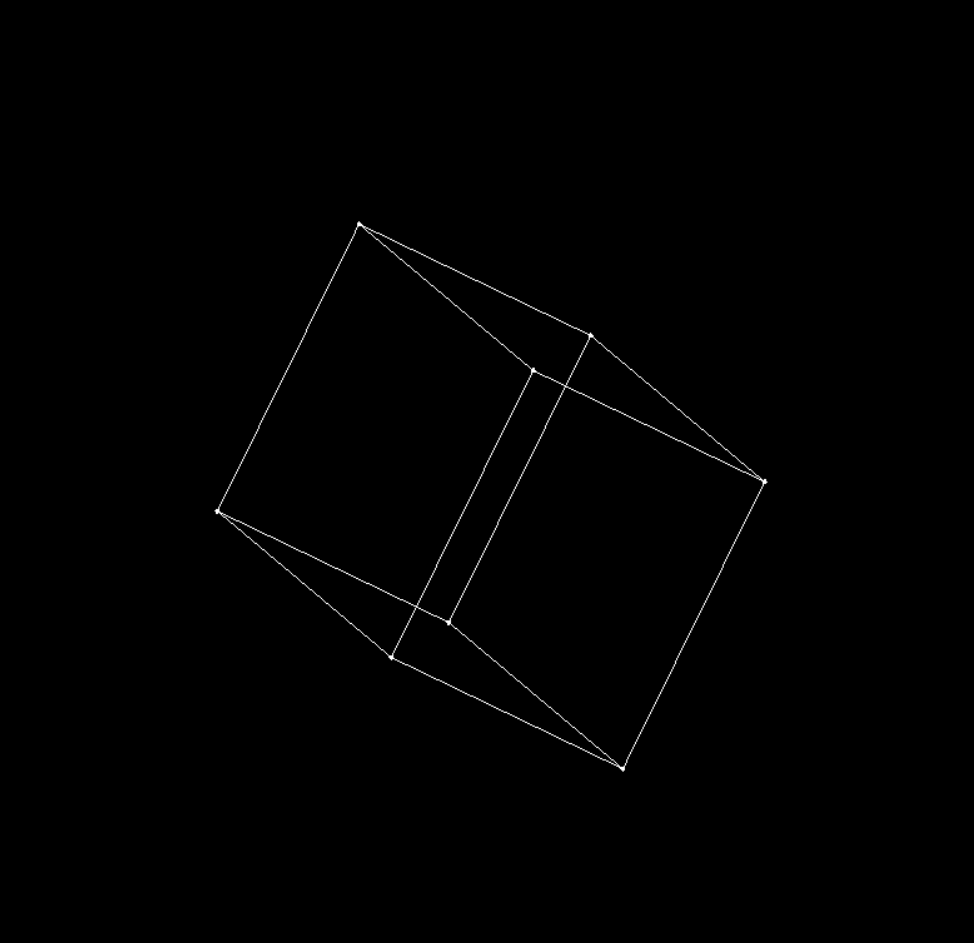
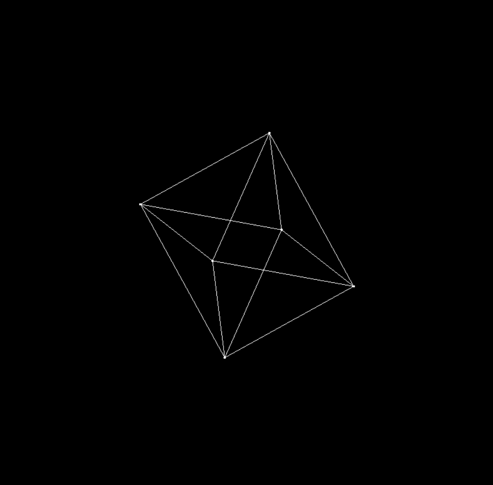
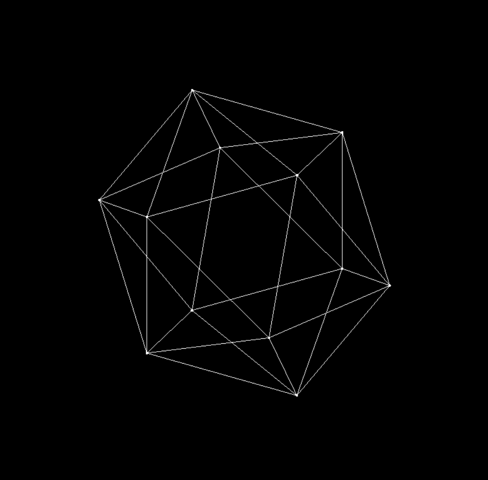
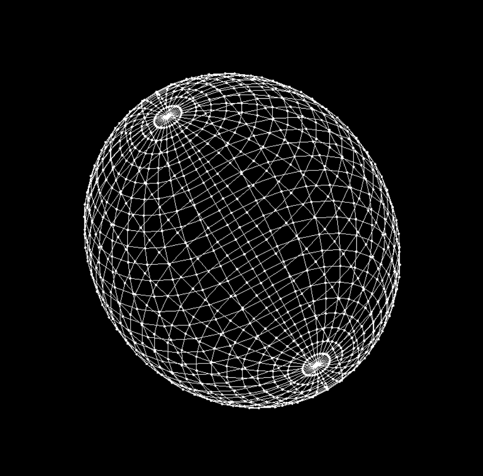

A visualizer of polyhedrons (and of a sphere) written in C++ with SFML. 
TODO: Add a torus option

To compute the projections, I just used sympy in order to compute linear transformations and then put it in my code rather than relying an external library.

In order to navigate between polyhedrons, use the left and right keys of the keyboard.

Compilation:
```bash
g++ main.cpp mainWindow.cpp vector3d.cpp vector2d.cpp -o polyhedron -lsfml-graphics -lsfml-window -lsfml-system
```

Tetrahedron:


Cube:


Octahedron:


Icosahedron:


Sphere:


